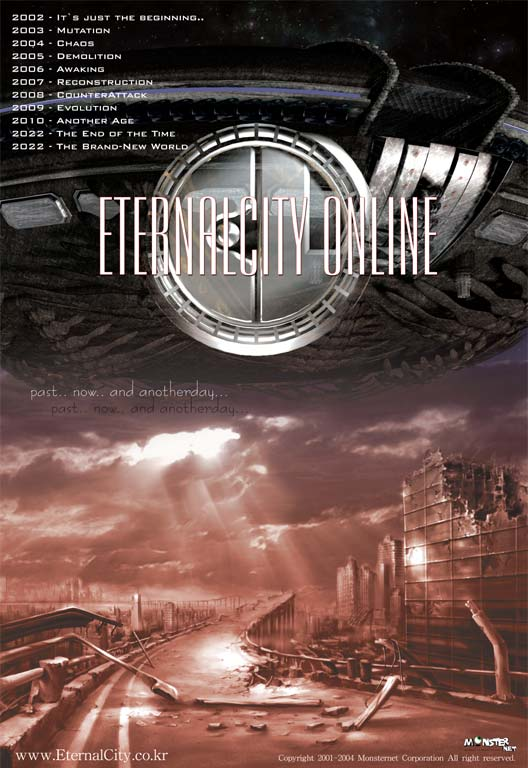

# RPG 게임 사례 조사

## 마녀의 샘

공식사이트 : https://www.kiwiwalks.com/  

 

**소개**  

마녀의 성장 방향,  
그리고 플레이어의 선택에 따라 마녀의 운명이 결정됩니다.  
아이루디는 친구를 만나 행복한 결말을 보게 되거나,  
또는 영원히 쓸쓸한 마녀로 살아갈 수도 있습니다.  
 
인형을 좋아하는 마녀 아이루디의 생존 이야기.  
아이루디의 운명을 이끌어주세요.  

**특징**
 
제작은 '도구 제작', '특별 도구', '주 마법진', '보조 마법진'의 네 카테고리로 나뉜다.  

특정 장비 착용 시에만 사용 가능한 기술도 존재한다.  

전격 마법으로 일정량 이상 피해를 줄 시 상대방에게 기절 효과가 적용된다.  

최고 레벨 마법만 전체 범위 공격이었던 전작과 달리, 상위 마법으로 갈수록 단계별로 공격 범위가 증가한다.

# 이터널 시티 (엠게임)

[이터널시티공식사이트](http://eternalcity.mgame.com/)

###### 게임소개

이터널 시티는 2003년 엠게임 에서 시작해  16 년째 서비스 중인 MMORPG 게임.  불도저라는 게임사에서 만든 자체 엔진을 사용 하였다.

###### 특징
이터널 시티의 특징은 보통 RPG게임과는 다르게 현대를 설정으로 하였고.  간판, 거리, 차량 같은 배경을 2002 년 대한민국을 베이스로 하였으므로 플레이어에게 친숙함을 주었으며. 게임 플레이는 몬스터를 잡아 랜덤으로 드랍한 장비로 튜닝 및 강화하여 장착 할 수 있다. 특히 재미있는 점이 채널이름은 1491년 대마도 정벌, 2002년 폭력의 도시 등으로 되어있는점이다
최고 레벨 마법만 전체 범위 공격이었던 전작과 달리, 상위 마법으로 갈수록 단계별로 공격 범위가 증가한다.  

## 나르실리온

### 2002년 작품
 
 
 
 

레벨이 없고 경험치를 모아서 스탯을 살 수있다.
룬을 모아서 마법을 배울 수 있다.
4명의 캐릭터중 하나를 플레이어가 조종하고 나머지는 ai이다.

게임 공략 : http://game.donga.com/5345/
 
